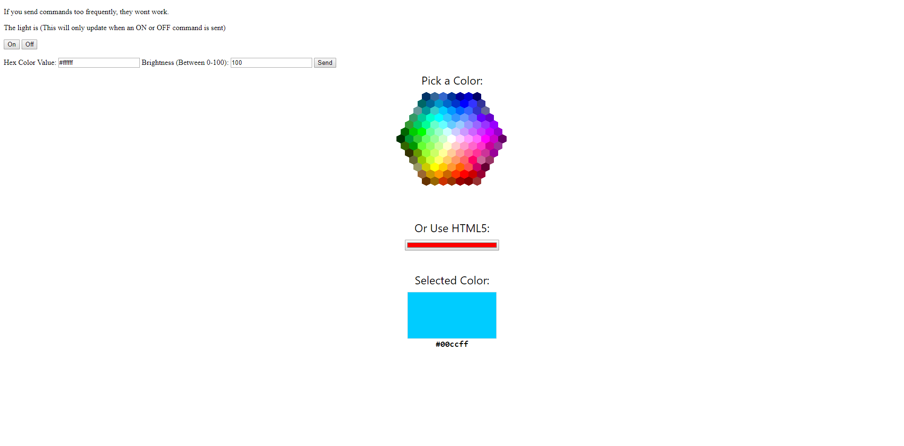

## TP-Link-Smart-Bulb-Web-Interface

A simple Web interface to control TP Link Smart bulbs.

Uses Konsumer's [tplink-lightbulb API](https://github.com/konsumer/tplink-lightbulb)

The color picker on the interface was taken from [w3schools](https://www.w3schools.com/colors/colors_picker.asp)

First you will need to set the bulbs IP address in the server.js, You can find this using your router or the scan command on Konsumer's tplink-lightbulb API.

You can then simply run the server.js using``` node server.js ```and go to localhost in your browser.

I do recommend using [nodemon](https://github.com/remy/nodemon#nodemon) instead to run the server.js like this``` nodemon server.js ```as it will automatically restart after you change the code.

This has been tested using an LB130 but should work for any of the bulbs listed in Konsumer's README.

Here is a screen shot of the web interface, It doesn't look great but it works :)

